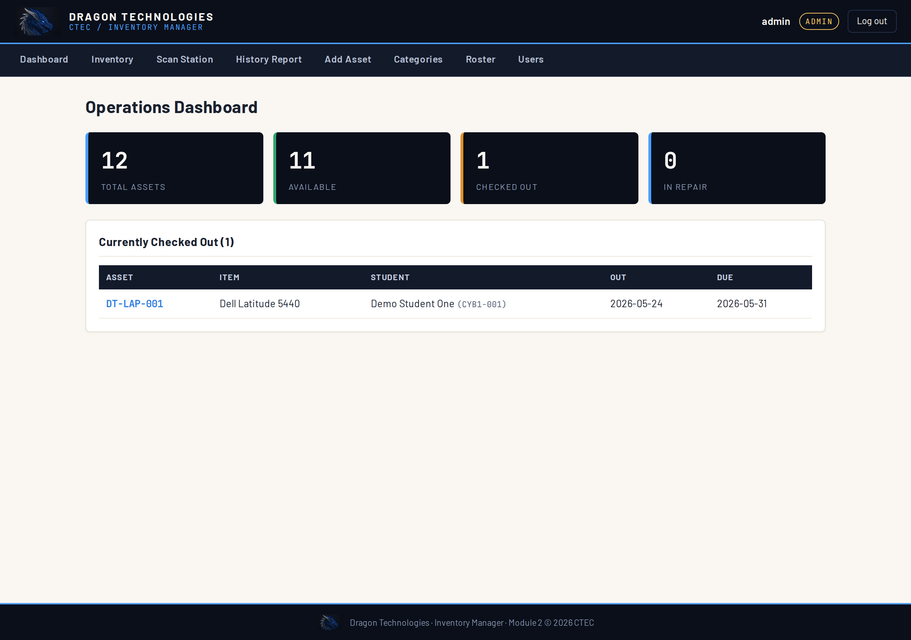
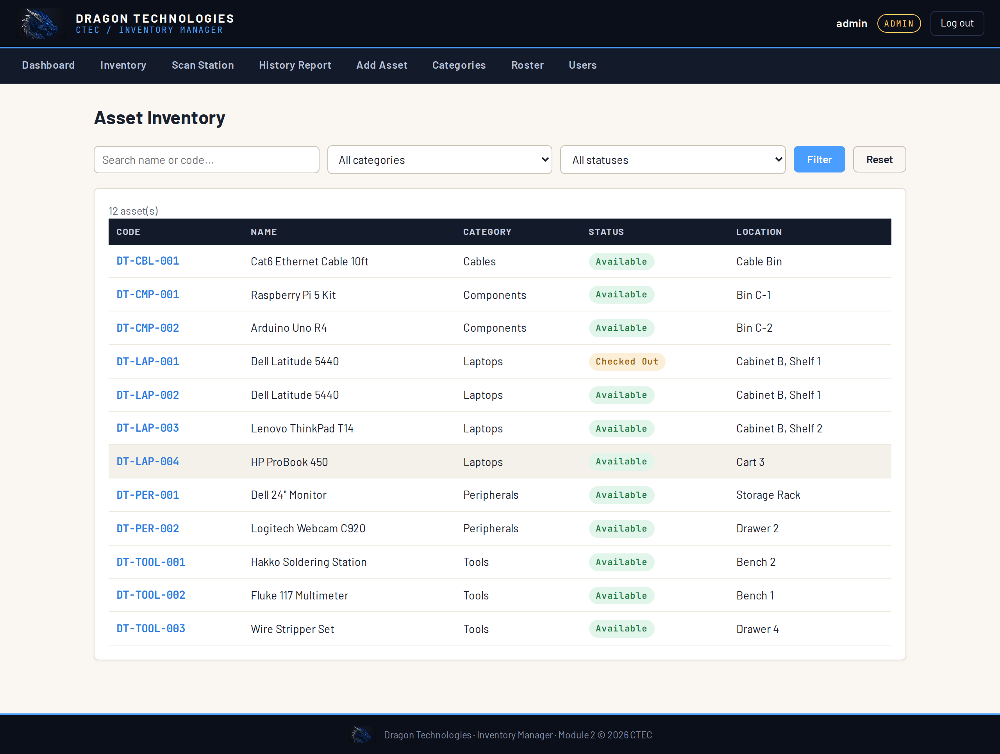
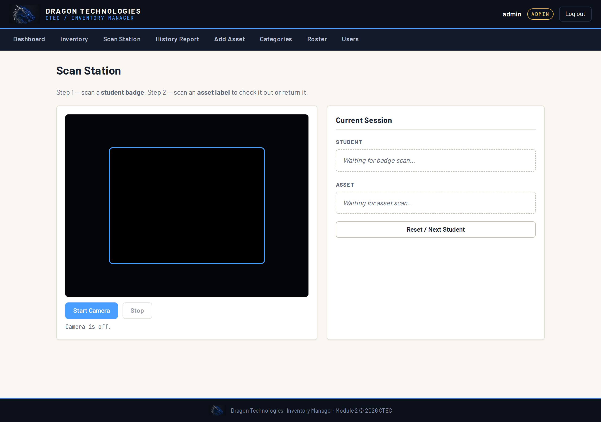
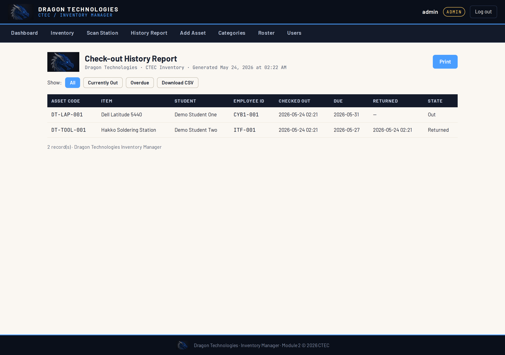

# INVENTORY MANAGER — CTEC

A simulated-workplace inventory system for the CTEC Computer Engineering / IT
classroom. Students track classroom hardware — laptops, tools, components — and
check items in and out as if they were managing a real IT company's stockroom.

*Built by Ciri for an AI-powered classroom operations ecosystem.*

> This is **Module 2** of the CTEC suite. Module 1 is **CLOCKIN**, the QR-badge
> time clock. The two apps are independent but share one key — the
> `employee_id` printed on each student's CLOCKIN badge.



*The Operations Dashboard — asset counts, and a live list of what's currently
checked out. (Sample data — all student names are fictional.)*

---

## Table of contents

- [What it does](#what-it-does)
- [Install via Portainer (for teachers — easiest path)](#install-via-portainer-for-teachers--easiest-path)
- [Install via Portainer — Web editor](#install-via-portainer--web-editor)
- [Install manually (without Portainer)](#install-manually-without-portainer)
- [What's in the box](#whats-in-the-box)
- [Quick start (developer / source install)](#quick-start-developer--source-install)
- [Roles and accounts](#roles-and-accounts)
- [Categories and item codes](#categories-and-item-codes)
- [Item management](#item-management)
- [The scan station — check-out and return](#the-scan-station--check-out-and-return)
- [Student roster](#student-roster)
- [The check-out history report](#the-check-out-history-report)
- [CSV format](#csv-format)
- [Security notes](#security-notes)
- [Backup](#backup)
- [Docker reference commands](#docker-reference-commands)
- [What's intentionally NOT in this version](#whats-intentionally-not-in-this-version)
- [What's next](#whats-next)

---

## What it does

The Inventory Manager is a classroom tool, not an official asset system. **It
does not replace, sync with, or report to any district or school asset
database.** It is a self-contained teaching app: a place for students to
practice the real-world skill of inventory management in a low-stakes,
simulated environment.

The framing is a workplace simulation. Students at CTEC "work for" a fictional
company, **Dragon Technologies**. The classroom is the company's IT department,
and this app is the company's stockroom system. A few students hold the
"stockroom manager" job; the rest are employees who check gear out and back in.
It gives the classroom the texture of a real IT workplace.

In plain terms, the app lets you:

- Keep a catalog of classroom **assets** — each laptop, tool, or monitor is one
  tracked item with its own auto-generated code and status.
- Let students **check items out and return them** at a shared scan station,
  using the same QR badge they already carry for CLOCKIN.
- Organize items into **categories**, each of which can cap how many items a
  single student may hold at once.
- Track **due dates** and see overdue items flagged on the dashboard.
- Maintain a **student roster**, imported from a CLOCKIN CSV export or entered
  by hand.
- Print a **check-out history report** showing who had what, and when.

This version (Phase 1) handles assets. Consumable supplies and printed QR
labels are planned — see [What's next](#whats-next).

---

## Install via Portainer (for teachers — easiest path)

This is the recommended path for the classroom deployment on the lab server.
It builds the app straight from this GitHub repository.

1. In Portainer, open **Stacks** and click **Add stack**.
2. Give the stack a name, for example `inventory-manager`.
3. Under **Build method**, choose **Repository**.
4. **Repository URL:** `https://github.com/Chavi7/inventory-manager`
5. **Repository reference:** `refs/heads/main`
6. **Compose path:** `compose.yml`
7. Before deploying, open the **Environment variables** section (or edit the
   compose file in the editor) and set a real value for
   `INVENTORY_SECRET_KEY` — a long random string. Do not leave the placeholder.
8. Click **Deploy the stack**.

When it finishes, the app is reachable on the server at port **5001**
(for example `http://your-server-ip:5001`). Port 5001 is chosen so it does not
collide with CLOCKIN; change the host port in the compose file if 5001 is
already in use.

Log in with the seeded admin account (see [Roles and accounts](#roles-and-accounts))
and change the password right away.

---

## Install via Portainer — Web editor

This is the fastest install. It uses a pre-built image published to GitHub
Container Registry (GHCR), so the server does not need to clone the repo or
build anything. New versions are published automatically on every push to
`main` by a GitHub Actions workflow.

The image is public — no GHCR login is needed on the server.

1. In Portainer, open **Stacks** and click **Add stack**.
2. Name the stack, for example `inventory-manager`.
3. Under **Build method**, choose **Web editor**.
4. Open `compose.web-editor.yml` in this repo and copy its entire contents
   into the editor.
5. Scroll down to **Environment variables** and click **Add an environment
   variable**:
   - **name:** `INVENTORY_SECRET_KEY`
   - **value:** a long random string. On a Mac or Linux machine,
     `python3 -c "import secrets; print(secrets.token_hex(32))"`
     prints a good one.
6. Click **Deploy the stack**.

The app is reachable at host port **5001** (e.g. `http://your-server-ip:5001`).

**Updating later.** When a new version is pushed to `main`, GHCR gets a new
`:latest` image automatically. In Portainer, open the stack and click
**Pull and redeploy** — Portainer pulls the newest image and restarts the
container. The database in the `inventory-data` volume is untouched.

**Image tags published.** Every push to `main` updates `:latest`, `:main`, and
a `:sha-<short>` tag for the exact commit. Tagged releases (`vX.Y.Z`) also
publish `:vX.Y.Z` and `:X.Y` tags, so you can pin a specific version in your
compose file instead of tracking `:latest` if you want stability over recency.

---

## Install manually (without Portainer)

For a server with Docker and Docker Compose but no Portainer:

```bash
git clone https://github.com/Chavi7/inventory-manager.git
cd inventory-manager
```

Open `compose.yml` and set a real `INVENTORY_SECRET_KEY`. Then:

```bash
docker compose up -d --build
```

The app runs on host port **5001**. The SQLite database lives in a named Docker
volume (`inventory-data`) so it survives container rebuilds.

---

## What's in the box

```
inventory-manager/
├── README.md
├── Dockerfile               # builds the app image (Python 3.12 slim + gunicorn)
├── compose.yml       # Portainer / Compose stack definition
├── requirements.txt         # Python dependencies: Flask, bcrypt, gunicorn
├── .gitignore
└── app/
    ├── app.py               # Flask application — routes, auth, checkout logic
    ├── db.py                # SQLite schema, connection helper, first-run seed
    ├── static/
    │   ├── css/
    │   │   └── style.css    # the entire "dragon-tech ops console" theme
    │   ├── fonts/           # self-hosted Barlow + JetBrains Mono (no CDN)
    │   ├── img/             # DragonForge logo files (shared with CLOCKIN)
    │   └── js/
    │       ├── jsQR.js      # self-hosted QR decoder for the scan station
    │       └── scan.js      # scan station camera + checkout flow
    └── templates/           # Jinja2 HTML templates, one per screen
```

Everything is self-hosted — fonts and the QR library ship with the app — so it
runs on a firewalled school network with no outside connections.

---

## Quick start (developer / source install)

For working on the code, or testing on a laptop without Docker. Requires
Python 3.

```bash
git clone https://github.com/Chavi7/inventory-manager.git
cd inventory-manager
python3 -m venv venv
source venv/bin/activate
pip install -r requirements.txt
cd app
python3 app.py
```

Then open `http://localhost:5000` in a browser.

On a source run, no environment variables are needed. The app creates a local
`app/data/inventory.db` automatically and seeds it on first launch. (In Docker,
the compose file points the database at the `/data` volume instead — the same
pattern CLOCKIN uses.)

Stop the app with `Ctrl+C`. The development server prints a "do not use in
production" warning — that is expected and fine for source testing; the Docker
deployment uses gunicorn as the production server.

---

## Roles and accounts

The app has three roles:

| Role      | Who it's for              | Can do                                                        |
|-----------|---------------------------|---------------------------------------------------------------|
| `admin`   | The teacher               | Everything — items, categories, users, roster, reports        |
| `manager` | Student stockroom staff   | Add / edit / delete items, run the scan station               |
| `student` | Everyone else             | View inventory, use the scan station to check out and return  |

On first launch the database is seeded with **one admin account** —
username `admin`, password `dragon-admin`. **Change this password immediately**
after the first login, on a real deployment. (The simplest way: as admin, add a
new admin account with a strong password on the Users page, then delete the
seeded `admin` account.)

The seed also adds **two demo students** so the scan station can be tested
before a real roster is imported. Delete them once your roster is in.

---

## Categories and item codes

Every item belongs to a category. A category defines two things: a short
**prefix** used to build item codes, and an optional **checkout limit**.

Item codes are generated automatically. A category with prefix `LAP` produces
codes `DT-LAP-001`, `DT-LAP-002`, and so on — the `DT` standing for Dragon
Technologies. Codes are never reused; each category keeps its own counter.

The checkout limit caps how many items from that category one student may have
out at the same time. For example, the seeded **Laptops** category has a limit
of 1, so a student cannot check out a second laptop until the first is
returned. A category with no limit set is unlimited.

The database is seeded with five categories: Laptops (`LAP`, limit 1),
Tools (`TOOL`), Components (`CMP`), Peripherals (`PER`), and Cables (`CBL`).
Admins can add more or change limits on the Categories page.

---

## Item management

Managers and admins can add, edit, and delete assets.

Each asset has a name, a category, a status, an optional location, and optional
notes. The status is one of **Available**, **Checked Out**, **In Repair**, or
**Retired-Lost**, shown as a colored pill throughout the app. When an item is
checked out at the scan station its status flips automatically — an item that
is currently checked out cannot have its status changed by hand or be deleted,
which keeps the records honest.

The Inventory page lists all assets and can be searched by name or code and
filtered by category and status. Each asset has a detail page showing its full
information and its complete check-out history.



*The Asset Inventory list — searchable and filterable, with each asset's
auto-generated code and status pill. (Sample data.)*

---

## The scan station — check-out and return

The scan station is a shared screen, intended for one webcam-equipped PC in the
classroom. It is how students check items out and back in.

The flow has two steps. First the student scans their **CLOCKIN badge** — the
station reads the badge, identifies the student, and greets them by name.
Then they scan an **asset's code**; the station shows the item and offers the
appropriate action — Check Out if the item is available, Return if it is
currently out. Checkout length (1, 3, 7, or 14 days) is chosen at checkout, and
the due date is recorded.

The badge is the integration with CLOCKIN. A CLOCKIN badge encodes a small JSON
object; the scan station parses it and uses the `employee_id` field to find the
student in the inventory roster. The same physical badge a student already
carries works here — no second badge, no CLOCKIN code changes.

If a scan does not work the station says why, distinguishing three cases: the
code is not a valid CLOCKIN badge, the badge is valid but the student is not in
the inventory roster yet, or the student account is inactive.



*The Scan Station — the camera view on the left, the current check-out session
on the right. A student badge scan fills the Student slot; an asset scan fills
the Asset slot.*

> **Note on QR codes:** the scan station reads two kinds of codes — CLOCKIN
> student badges (already printed by CLOCKIN) and asset codes. This version
> does **not** yet generate printable QR labels for assets; printing asset
> labels is planned (see [What's next](#whats-next)). To test the scan station
> now, generate a QR code containing the literal asset code, e.g. `DT-LAP-001`.

---

## Student roster

The roster is the list of students who can have items checked out to them. It
is separate from the login accounts on the Users page — a student in the roster
is someone a badge scan can resolve to, not necessarily someone who logs in.

Each roster entry is keyed by `employee_id`, the same identifier used on the
student's CLOCKIN badge (for example `CYB1-003` or `ITF-001`). Because the key
matches, importing the roster CLOCKIN already has is the intended way to
populate this app.

Admins populate the roster two ways: by importing a CSV (see below), or by
adding students one at a time on the Roster page. A CSV import updates students
who already exist rather than duplicating them, so re-importing an updated
roster is safe.

---

## The check-out history report

The History Report lists every check-out event — which asset, which student,
when it went out, when it was due, and when it came back. It can be filtered to
show everything, only items currently out, or only overdue items, and it has a
print-friendly layout with the Dragon Technologies logo for a paper copy. The
same data can also be downloaded as a CSV.



*The Check-out History Report — every check-out event, filterable and
print-ready. (Sample data — fictional students.)*

---

## CSV format

The roster importer expects a CSV with a header row. Only `employee_id` is
required; the other columns are optional but recommended.

| Column        | Required | Description                                              |
|---------------|----------|----------------------------------------------------------|
| `employee_id` | Yes      | The student's CLOCKIN identifier, e.g. `CYB1-003`        |
| `name`        | No       | Student's display name; falls back to the ID if blank    |
| `student_id`  | No       | The school's official ID number                         |
| `section`     | No       | Class section, e.g. `CYB1`                               |

The CLOCKIN roster export already uses a column named exactly `employee_id`, so
a CLOCKIN export imports here directly. Rows whose `employee_id` already exists
are updated in place; new rows are added.

---

## Security notes

- Passwords are hashed with **bcrypt**. Plain passwords are never stored.
- `INVENTORY_SECRET_KEY` signs login sessions. On any real deployment, set it
  to a long random value. The placeholder in `compose.yml` must be
  changed before deploying.
- The seeded `admin` / `dragon-admin` account is a convenience for first login
  only. Change that password immediately on a real deployment.
- This app is built for a **trusted classroom network**. It has no rate
  limiting, no HTTPS of its own, and no defense against a hostile user on the
  same network. It is not intended to be exposed to the public internet. If it
  must be reachable from outside, put it behind a reverse proxy that handles
  HTTPS and access control.
- The repository is public — never commit a real student roster or a real
  `INVENTORY_SECRET_KEY`. The database file is git-ignored.

---

## Backup

The whole application state is one SQLite file. Backing up means copying that
file. Where it lives depends on how the app is running.

**Running from source.** The database is `app/data/inventory.db` inside the
project folder. Copy it while the app is stopped:

```bash
cp app/data/inventory.db ~/inventory-backup-$(date +%Y%m%d).db
```

**Running in Docker.** The database lives in the `inventory-data` named volume,
not in the project folder. Copy it out of the running container:

```bash
docker cp inventory-manager:/data/inventory.db ./inventory-backup-$(date +%Y%m%d).db
```

Keep backups somewhere private — the file contains your roster.

---

## Docker reference commands

Run these from the project folder (the one with `compose.yml`).

| Task                        | Command                                  |
|-----------------------------|------------------------------------------|
| Build and start             | `docker compose up -d --build`           |
| Stop                        | `docker compose down`                    |
| Restart                     | `docker compose restart`                 |
| View logs                   | `docker compose logs -f`                 |
| Rebuild after a code change | `docker compose up -d --build`           |

The named volume `inventory-data` persists across `down` and rebuilds. Removing
the volume deletes the database — do not do that unless you mean to.

---

## What's intentionally NOT in this version

To keep Phase 1 focused and honest about scope, the following are deliberately
left out:

- **Consumable supplies.** This version tracks assets — uniquely identified
  items. Quantity-tracked consumables (resistors, wire, solder) are planned but
  not built. The database already has the columns for them; the screens do not.
- **Printable asset QR labels.** The scan station can *read* an asset code, but
  the app does not yet *generate* the printable label sheet.
- **A live connection to CLOCKIN.** The two apps share the `employee_id` key
  and the physical badge, but they do not talk to each other over the network.
  The roster is synced by CSV, by hand, on purpose — it keeps the two apps
  fully independent.
- **Email or notifications.** Overdue items are flagged in the app's dashboard;
  the app does not send messages.
- **Public-internet hardening.** See [Security notes](#security-notes).

### Known limitations

The scan station needs a working webcam and a browser permitted to use it; on a
locked-down school PC that may need a one-time permission grant. The app runs a
single worker process, which is correct for one classroom but is not built for
many simultaneous schools or campuses.

---

## What's next

The module roadmap, in rough order:

- **Phase 2 — Consumables.** Quantity-tracked supplies with a low-stock
  threshold and a dashboard warning when stock runs low. The dashboard already
  has the low-stock panel wired and waiting.
- **Phase 2 — Asset QR labels.** A printable label sheet, with the Dragon
  Technologies logo, so every asset gets a scannable sticker.
- **Tighter CLOCKIN integration.** Possibly a direct roster sync, so importing
  a CSV by hand is no longer necessary — designed carefully so the two apps
  stay independently deployable.

---

*Built for CTEC — the Dragon Technologies classroom operations suite. — Ciri*
