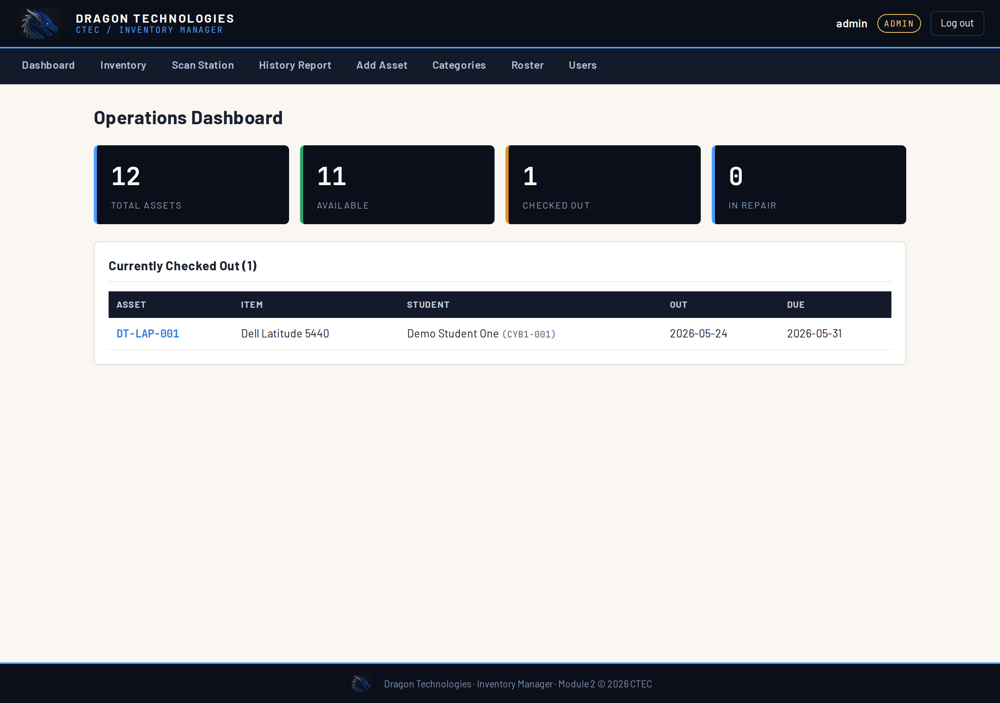
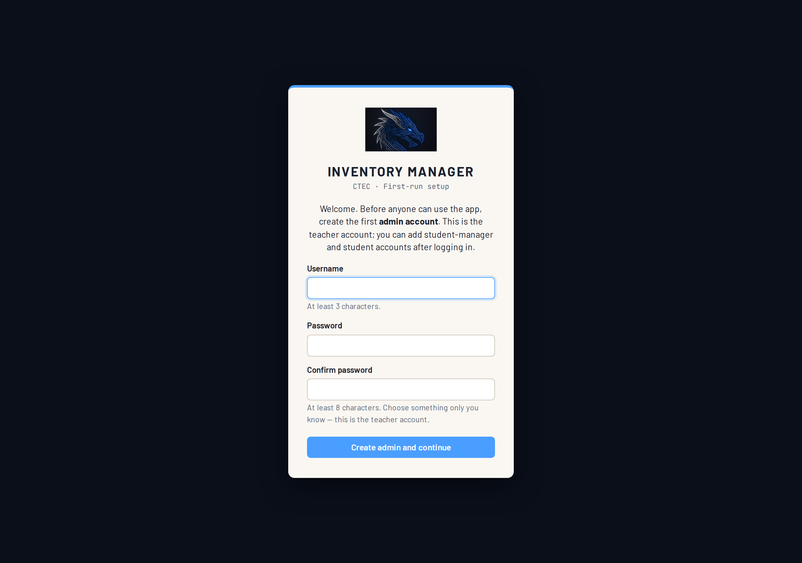
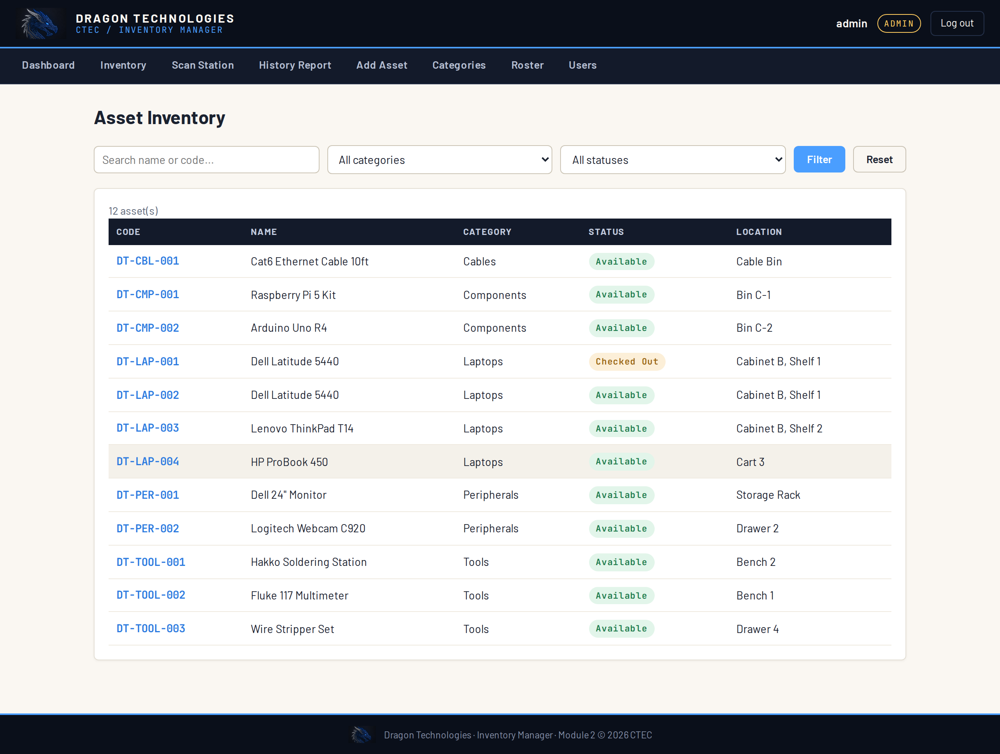
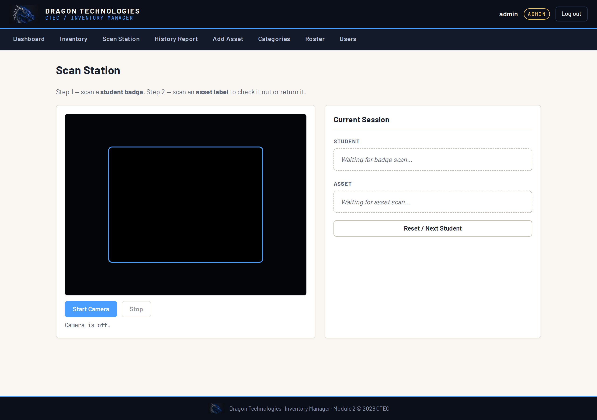
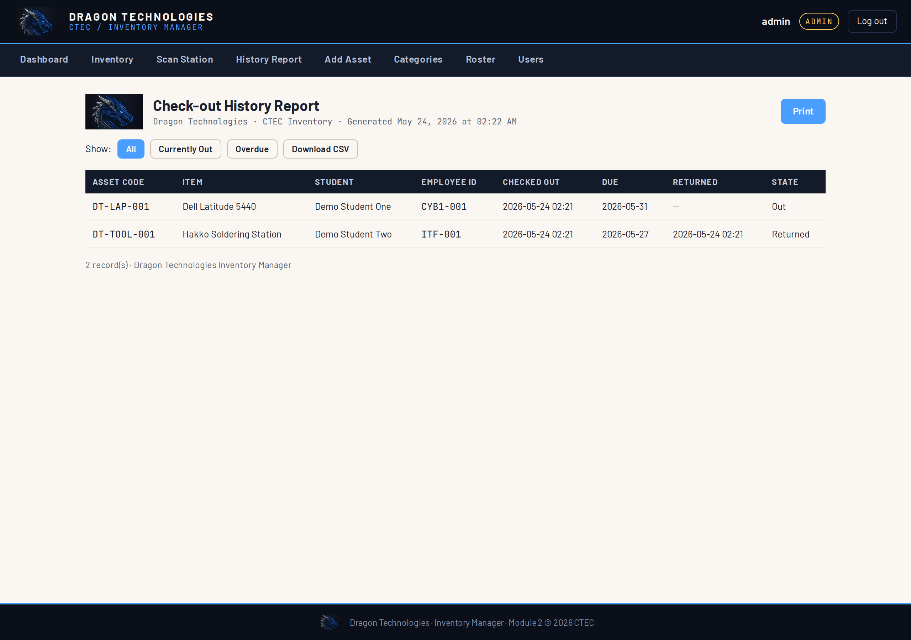

# INVENTORY MANAGER — CTEC

A simulated-workplace inventory system for the CTEC Computer Engineering / IT
classroom. Students track classroom hardware — laptops, tools, components — and
check items in and out as if they were managing a real IT company's stockroom.

*Built by Ciri for an AI-powered classroom operations ecosystem.*

> This is **Module 2** of the CTEC suite. Module 1 is **CLOCKIN**, the QR-badge
> time clock. The two apps are independent but share one key — the
> `employee_id` printed on each student's CLOCKIN badge.



*The Operations Dashboard — asset counts, and a live list of what's currently
checked out. (Sample data — all student names are fictional.)*

---

## Table of contents

- [What it does](#what-it-does)
- [Install via Portainer (for teachers — easiest path)](#install-via-portainer-for-teachers--easiest-path)
- [Install via Portainer — Web editor](#install-via-portainer--web-editor)
- [Install manually (without Portainer)](#install-manually-without-portainer)
- [What's in the box](#whats-in-the-box)
- [Quick start (developer / source install)](#quick-start-developer--source-install)
- [Roles and accounts](#roles-and-accounts)
- [First-run setup](#first-run-setup)
- [Categories and item codes](#categories-and-item-codes)
- [Item management](#item-management)
- [The scan station — check-out and return](#the-scan-station--check-out-and-return)
- [Printing QR labels](#printing-qr-labels)
- [Consumables](#consumables)
- [Student roster](#student-roster)
- [The check-out history report](#the-check-out-history-report)
- [CSV format](#csv-format)
- [Security notes](#security-notes)
- [Backup](#backup)
- [Docker reference commands](#docker-reference-commands)
- [What's intentionally NOT in this version](#whats-intentionally-not-in-this-version)
- [What's next](#whats-next)

---

## What it does

The Inventory Manager is a classroom tool, not an official asset system. **It
does not replace, sync with, or report to any district or school asset
database.** It is a self-contained teaching app: a place for students to
practice the real-world skill of inventory management in a low-stakes,
simulated environment.

The framing is a workplace simulation. Students at CTEC "work for" a fictional
company, **Dragon Technologies**. The classroom is the company's IT department,
and this app is the company's stockroom system. A few students hold the
"stockroom manager" job; the rest are employees who check gear out and back in.
It gives the classroom the texture of a real IT workplace.

In plain terms, the app lets you:

- Keep a catalog of classroom **assets** — each laptop, tool, or monitor is one
  tracked item with its own auto-generated code and status.
- Let students **check items out and return them** at a shared scan station,
  using the same QR badge they already carry for CLOCKIN.
- Organize items into **categories**, each of which can cap how many items a
  single student may hold at once.
- Track **due dates** and see overdue items flagged on the dashboard.
- Maintain a **student roster**, imported from a CLOCKIN CSV export or entered
  by hand.
- Print a **check-out history report** showing who had what, and when.
- Generate **printable QR labels** for both assets and consumable bins — a PDF
  sheet you print, cut out, and stick on the gear or the bin, so every item
  carries the code the scan station reads.
- Track **consumable supplies** — quantity-counted items like resistors, wire,
  and solder — restocking and dispensing them, optionally recording which
  student received a dispense, with a low-stock warning when a bin runs low.
- **Dispense consumables at the scan station**, scanning a supply bin's label
  the same way assets are checked out, with optional student attribution.

This version handles both individually tracked **assets** and quantity-tracked
**consumables**, at the item screens and at the shared scan station alike. See
[What's next](#whats-next) for what's still on the roadmap.

---

## Install via Portainer (for teachers — easiest path)

This is the recommended path for the classroom deployment on the lab server.
It builds the app straight from this GitHub repository.

1. In Portainer, open **Stacks** and click **Add stack**.
2. Give the stack a name, for example `inventory-manager`.
3. Under **Build method**, choose **Repository**.
4. **Repository URL:** `https://github.com/Chavi7/inventory-manager`
5. **Repository reference:** `refs/heads/main`
6. **Compose path:** `compose.yml`
7. Before deploying, open the **Environment variables** section (or edit the
   compose file in the editor) and set a real value for
   `INVENTORY_SECRET_KEY` — a long random string. Do not leave the placeholder.
8. Click **Deploy the stack**.

When it finishes, the app is reachable on the server at port **5001**
(for example `http://your-server-ip:5001`). Port 5001 is chosen so it does not
collide with CLOCKIN; change the host port in the compose file if 5001 is
already in use.

On the very first visit, the app loads the **First-run setup screen** — there
is no default admin account. You create the admin (username and password) right
there, then log in with what you just chose. See
[First-run setup](#first-run-setup) below.

---

## Install via Portainer — Web editor

This is the fastest install. It uses a pre-built image published to GitHub
Container Registry (GHCR), so the server does not need to clone the repo or
build anything. New versions are published automatically on every push to
`main` by a GitHub Actions workflow.

The image is public — no GHCR login is needed on the server.

1. In Portainer, open **Stacks** and click **Add stack**.
2. Name the stack, for example `inventory-manager`.
3. Under **Build method**, choose **Web editor**.
4. Open `compose.web-editor.yml` in this repo and copy its entire contents
   into the editor.
5. Scroll down to **Environment variables** and click **Add an environment
   variable**:
   - **name:** `INVENTORY_SECRET_KEY`
   - **value:** a long random string. On a Mac or Linux machine,
     `python3 -c "import secrets; print(secrets.token_hex(32))"`
     prints a good one.
6. Click **Deploy the stack**.

The app is reachable at host port **5001** (e.g. `http://your-server-ip:5001`).

**Updating later.** When a new version is pushed to `main`, GHCR gets a new
`:latest` image automatically. In Portainer, open the stack and click
**Pull and redeploy** — Portainer pulls the newest image and restarts the
container. The database in the `inventory-data` volume is untouched.

**Image tags published.** Every push to `main` updates `:latest`, `:main`, and
a `:sha-<short>` tag for the exact commit. Tagged releases (`vX.Y.Z`) also
publish `:vX.Y.Z` and `:X.Y` tags, so you can pin a specific version in your
compose file instead of tracking `:latest` if you want stability over recency.

---

## Install manually (without Portainer)

For a server with Docker and Docker Compose but no Portainer:

```bash
git clone https://github.com/Chavi7/inventory-manager.git
cd inventory-manager
```

Open `compose.yml` and set a real `INVENTORY_SECRET_KEY`. Then:

```bash
docker compose up -d --build
```

The app runs on host port **5001**. The SQLite database lives in a named Docker
volume (`inventory-data`) so it survives container rebuilds.

---

## What's in the box

```
inventory-manager/
├── README.md
├── LICENSE                   # MIT
├── Dockerfile                # builds the app image (Python 3.12 slim + gunicorn)
├── compose.yml               # Portainer / Compose stack — builds from source
├── compose.web-editor.yml    # Portainer web editor — pulls the pre-built image
├── requirements.txt          # Python deps: Flask, bcrypt, gunicorn, qrcode, reportlab
├── .gitignore
├── .dockerignore             # keeps .git, the database, venv out of the image
├── .gitattributes            # marks the vendored QR library so language stats stay accurate
├── .github/
│   └── workflows/
│       └── publish.yml       # builds and pushes the image to GHCR on every push to main
├── docs/                     # README screenshots (fictional sample data)
└── app/
    ├── app.py                # Flask application — routes, auth, checkout logic
    ├── db.py                 # SQLite schema, connection helper, first-run seed
    ├── consumables.py        # consumable stock-adjustment rules (restock / dispense)
    ├── labels.py             # QR label PDF generation (qrcode + reportlab)
    ├── static/
    │   ├── css/
    │   │   └── style.css     # the entire "dragon-tech ops console" theme
    │   ├── fonts/            # self-hosted Barlow + JetBrains Mono (no CDN)
    │   ├── img/              # DragonForge logo files (shared with CLOCKIN)
    │   └── js/
    │       ├── jsQR.js       # self-hosted QR decoder for the scan station
    │       └── scan.js       # scan station camera + checkout flow
    └── templates/            # Jinja2 HTML templates, one per screen
```

Everything is self-hosted — fonts and the QR library ship with the app — so it
runs on a firewalled school network with no outside connections.

---

## Quick start (developer / source install)

For working on the code, or testing on a laptop without Docker. Requires
Python 3.

```bash
git clone https://github.com/Chavi7/inventory-manager.git
cd inventory-manager
python3 -m venv venv
source venv/bin/activate
pip install -r requirements.txt
cd app
python3 app.py
```

Then open `http://localhost:5000` in a browser. (A source run uses Flask's
default port 5000. The Docker deployments map it to host port 5001 instead, to
avoid colliding with CLOCKIN — so the different port number between this section
and the install sections is intentional, not a typo.)

On a source run, no environment variables are needed. The app creates a local
`app/data/inventory.db` automatically and seeds the **default categories** on
first launch. It does **not** seed any user account; the first time you load
the app, the [First-run setup](#first-run-setup) screen appears so you can
create the admin yourself. (In Docker, the compose file points the database at
the `/data` volume instead — the same pattern CLOCKIN uses.)

Stop the app with `Ctrl+C`. The development server prints a "do not use in
production" warning — that is expected and fine for source testing; the Docker
deployment uses gunicorn as the production server.

---

## Roles and accounts

The app has three roles:

| Role      | Who it's for            | Can do                                                       |
|-----------|-------------------------|--------------------------------------------------------------|
| `admin`   | The teacher             | Everything — items, categories, users, roster, reports       |
| `manager` | Student stockroom staff | Add / edit / delete items, run the scan station              |
| `student` | Everyone else           | View inventory, use the scan station to check out and return |

### First-run setup

On a fresh deployment the database starts empty of users. The first time
anyone visits the app, every route redirects to a **First-run setup** screen
where you create the initial admin account — your username, your password.
That account becomes the teacher account, and the setup screen disappears
once it's created. No default password ever exists in the codebase or on a
deployed instance.



*The First-run setup screen — shown only when no admin account exists yet.
Create the teacher account here and continue to login.*

### Testing the scan station

The database no longer seeds demo students, so a fresh deployment starts with
an empty roster. To try the scan station before you import a real CLOCKIN
roster, add a test student manually on the **Roster** page (any `employee_id`
will do, e.g. `TEST-001`), then generate a CLOCKIN-style badge JSON for that
student to scan:

```json
{"school":"CTEC","name":"Test Student","employee_id":"TEST-001","student_id":""}
```

Any QR-code generator can encode that JSON for a quick test. Real CLOCKIN
badges work the same way and need no setup beyond importing the roster.

---

## Categories and item codes

Every item belongs to a category. A category defines two things: a short
**prefix** used to build item codes, and an optional **checkout limit**.

Item codes are generated automatically. A category with prefix `LAP` produces
codes `DT-LAP-001`, `DT-LAP-002`, and so on — the `DT` standing for Dragon
Technologies. Codes are never reused; each category keeps its own counter.

The checkout limit caps how many items from that category one student may have
out at the same time. For example, the seeded **Laptops** category has a limit
of 1, so a student cannot check out a second laptop until the first is
returned. A category with no limit set is unlimited.

The database is seeded with five categories: Laptops (`LAP`, limit 1),
Tools (`TOOL`), Components (`CMP`), Peripherals (`PER`), and Cables (`CBL`).
Admins can add more or change limits on the Categories page.

---

## Item management

Managers and admins can add, edit, and delete assets.

Each asset has a name, a category, a status, an optional location, and optional
notes. The status is one of **Available**, **Checked Out**, **In Repair**, or
**Retired-Lost**, shown as a colored pill throughout the app. When an item is
checked out at the scan station its status flips automatically — an item that
is currently checked out cannot have its status changed by hand or be deleted,
which keeps the records honest.

The Inventory page lists all assets and can be searched by name or code and
filtered by category and status. Each asset has a detail page showing its full
information and its complete check-out history.



*The Asset Inventory list — searchable and filterable, with each asset's
auto-generated code and status pill. (Sample data.)*

---

## The scan station — check-out and return

The scan station is a shared screen, intended for one webcam-equipped PC in the
classroom. It is how students check items out and back in.

The flow has two steps. First the student scans their **CLOCKIN badge** — the
station reads the badge, identifies the student, and greets them by name.
Then they scan an **asset's code**; the station shows the item and offers the
appropriate action — Check Out if the item is available, Return if it is
currently out. Checkout length (1, 3, 7, or 14 days) is chosen at checkout, and
the due date is recorded.

The badge is the integration with CLOCKIN. A CLOCKIN badge encodes a small JSON
object; the scan station parses it and uses the `employee_id` field to find the
student in the inventory roster. The same physical badge a student already
carries works here — no second badge, no CLOCKIN code changes.

If a scan does not work the station says why, distinguishing three cases: the
code is not a valid CLOCKIN badge, the badge is valid but the student is not in
the inventory roster yet, or the student account is inactive.



*The Scan Station — the camera view on the left, the current check-out session
on the right. A student badge scan fills the Student slot; an asset scan fills
the Asset slot.*

> **Note on QR codes:** the scan station reads two kinds of codes — CLOCKIN
> student badges (already printed by CLOCKIN) and asset codes. You generate the
> asset codes from this app — see [Printing QR labels](#printing-qr-labels)
> below.

---

## Printing QR labels

Every item can be given a printed QR label, so the scan station can read it off
the device or the supply bin. The **Print Labels** page (admin and managers)
lists items; you search or filter to the ones you want, tick them, and click
**Generate PDF**. A **kind** filter (alongside search and category) narrows the
list to assets only, consumables only, or all items, and a Kind column marks
each row so you can tell the two apart at a glance.

The result is a print-ready PDF sheet — fifteen labels to a page on US Letter,
laid out in a grid with light cut guides. Each label shows the QR code (which
encodes the item code, e.g. `DT-LAP-001` for an asset or `DT-CMP-007` for a
consumable bin), the code itself in mono text, and the item name. Print it on
plain paper, cut the labels out along the guides, and stick them on the gear or
the bin. The QR codes are exactly what the scan station expects to read, so a
freshly printed label works immediately at checkout or dispense.

Labels are generated server-side with the `qrcode` and `reportlab` libraries —
the same toolchain CLOCKIN uses for its badges — so nothing leaves the local
network.

<!-- SCREENSHOT: the Print Labels selection page, and/or a generated label
     sheet. Fictional sample assets only. -->
*(Screenshot: Print Labels page — to be added.)*

---

## Consumables

Alongside assets, the app tracks **consumables** — supplies that are counted by
quantity rather than checked out one at a time. Resistors, jumper wire, solder,
and zip ties are consumables: you don't track each individual resistor, you
track how many are on hand and watch the count fall as the class uses them.

The **Consumables** page lists every consumable with its on-hand count and
low-stock threshold. It can be searched by name or code and filtered by
category, and a quick **Low stock only** filter narrows the list to bins that
have hit their threshold. Each consumable gets the same auto-generated item code
as an asset (for example `DT-CMP-007`), drawn from the same category counters.

Managers and admins add a consumable from the **Add Consumable** form: a name, a
category, an optional location and notes, a starting quantity, and an optional
low-stock threshold. Each consumable has a detail page showing its current
count, its threshold, and its full adjustment history.

Stock changes happen on that detail page through the **Adjust Stock** form,
which does one of two things:

- **Restock** adds to the count — a new order arrives, you add what came in.
- **Dispense** subtracts from the count — supplies handed out for a project.

Every adjustment **requires a note** explaining it (`Restock from order #4521`,
`Class soldering project`), so the history reads as a clear record rather than a
column of bare numbers. A dispense can **optionally name the student** who
received the supplies; that student then shows up in the adjustment history next
to the change. (Student attribution is ignored on a restock, where it would not
make sense.) Dispenses are **hard-blocked from going below zero** — the app
refuses to dispense more than is on hand rather than letting the count go
negative, so the recorded stock stays honest.

Consumables can also be dispensed at the **scan station**, which is faster for a
busy supply counter. Scanning a consumable's QR label loads it into the station
and shows its current on-hand count, then a manager enters an amount and a note
and clicks **Dispense**. A student badge is **optional** here — scan one first
and the dispense is attributed to that student, exactly as on the detail page;
skip it and the dispense is recorded with no student. The on-hand count updates
in place after each dispense, so handing the same supply to a line of students
is quick. Every dispense goes through the same rules — required note, no going
below zero — because the station calls the identical stock-adjustment logic the
detail page uses. (Restocking still happens on the detail page; the station only
dispenses.)

When a consumable's on-hand count falls to or below its low-stock threshold, it
is flagged on the Consumables list and surfaced in the **low-stock panel on the
dashboard**. That panel was built in Phase 1 and sat empty until consumables
gave it something to report; it now warns at a glance when a bin needs
reordering. Consumables with no threshold set are never flagged.

*(Screenshot: Consumables catalog, consumable detail, and the scan-station
dispense panel — to be added.)*

---

## Student roster

The roster is the list of students who can have items checked out to them. It
is separate from the login accounts on the Users page — a student in the roster
is someone a badge scan can resolve to, not necessarily someone who logs in.

Each roster entry is keyed by `employee_id`, the same identifier used on the
student's CLOCKIN badge (for example `CYB1-003` or `ITF-001`). Because the key
matches, importing the roster CLOCKIN already has is the intended way to
populate this app.

Admins populate the roster two ways: by importing a CSV (see below), or by
adding students one at a time on the Roster page. A CSV import updates students
who already exist rather than duplicating them, so re-importing an updated
roster is safe.

A third way — **Sync from CLOCKIN** — pulls the roster directly from the
CLOCKIN API with one click. This requires the two containers to be on the same
Docker network with a shared `CLOCKIN_API_KEY` (see the compose file). The sync
adds new students, updates existing ones, and deactivates anyone who's no longer
in CLOCKIN's roster.

---

## The check-out history report

The History Report lists every check-out event — which asset, which student,
when it went out, when it was due, and when it came back. It can be filtered to
show everything, only items currently out, or only overdue items, and it has a
print-friendly layout with the Dragon Technologies logo for a paper copy. The
same data can also be downloaded as a CSV.



*The Check-out History Report — every check-out event, filterable and
print-ready. (Sample data — fictional students.)*

---

## CSV format

The roster importer expects a CSV with a header row. Only `employee_id` is
required; the other columns are optional but recommended.

| Column        | Required | Description                                           |
|---------------|----------|-------------------------------------------------------|
| `employee_id` | Yes      | The student's CLOCKIN identifier, e.g. `CYB1-003`     |
| `name`        | No       | Student's display name; falls back to the ID if blank |
| `student_id`  | No       | The school's official ID number                       |
| `section`     | No       | Class section, e.g. `CYB1`                            |

The CLOCKIN roster export already uses a column named exactly `employee_id`, so
a CLOCKIN export imports here directly. Rows whose `employee_id` already exists
are updated in place; new rows are added.

---

## Security notes

- Passwords are hashed with **bcrypt**. Plain passwords are never stored.
- `INVENTORY_SECRET_KEY` signs login sessions. On any real deployment, set it
  to a long random value. The placeholder in `compose.yml` must be
  changed before deploying.
- **No default credentials.** The app ships with no admin account; the first
  visitor creates the admin via the First-run setup screen. This means there's
  no known password sitting in the public repo or in a deployed instance.
- This app is built for a **trusted classroom network**. It has no rate
  limiting, no HTTPS of its own, and no defense against a hostile user on the
  same network. It is not intended to be exposed to the public internet. If it
  must be reachable from outside, put it behind a reverse proxy that handles
  HTTPS and access control.
- The repository is public — never commit a real student roster or a real
  `INVENTORY_SECRET_KEY`. The database file is git-ignored.

---

## Backup

The whole application state is one SQLite file. Backing up means copying that
file. Where it lives depends on how the app is running.

**Running from source.** The database is `app/data/inventory.db` inside the
project folder. Copy it while the app is stopped:

```bash
cp app/data/inventory.db ~/inventory-backup-$(date +%Y%m%d).db
```

**Running in Docker.** The database lives in the `inventory-data` named volume,
not in the project folder. Copy it out of the running container:

```bash
docker cp inventory-manager:/data/inventory.db ./inventory-backup-$(date +%Y%m%d).db
```

Keep backups somewhere private — the file contains your roster.

---

## Docker reference commands

Run these from the project folder (the one with `compose.yml`).

| Task                        | Command                                  |
|-----------------------------|------------------------------------------|
| Build and start             | `docker compose up -d --build`           |
| Stop                        | `docker compose down`                    |
| Restart                     | `docker compose restart`                 |
| View logs                   | `docker compose logs -f`                 |
| Rebuild after a code change | `docker compose up -d --build`           |

The named volume `inventory-data` persists across `down` and rebuilds. Removing
the volume deletes the database — do not do that unless you mean to.

---

## What's intentionally NOT in this version

To keep the app focused and honest about scope, the following are deliberately
left out of this version:

- **A live connection to CLOCKIN.** The two apps share the `employee_id` key
  and the physical badge, but they do not talk to each other over the network.
  The roster is synced by CSV, by hand, on purpose — it keeps the two apps
  fully independent.
- **Email or notifications.** Overdue items are flagged in the app's dashboard;
  the app does not send messages.
- **Public-internet hardening.** See [Security notes](#security-notes).

### Known limitations

The scan station needs a working webcam and a browser permitted to use it; on a
locked-down school PC that may need a one-time permission grant. The app runs a
single worker process, which is correct for one classroom but is not built for
many simultaneous schools or campuses.

---

## What's next

The module roadmap, in rough order:

- **Tighter CLOCKIN integration.** Possibly a direct roster sync, so importing
  a CSV by hand is no longer necessary — designed carefully so the two apps
  stay independently deployable.

The consumables work that was on this list — the catalog, stock adjustments, and
low-stock alerts (Phase 2A), then scan-station dispense and consumable QR labels
(Phase 2B) — has now shipped and is documented above. The direct CLOCKIN roster
sync (live API pull instead of CSV import) has also shipped.

With this, the roadmap as written is complete. New ideas tracked as GitHub
issues going forward.

---

*Built for CTEC — the Dragon Technologies classroom operations suite. — Ciri*
